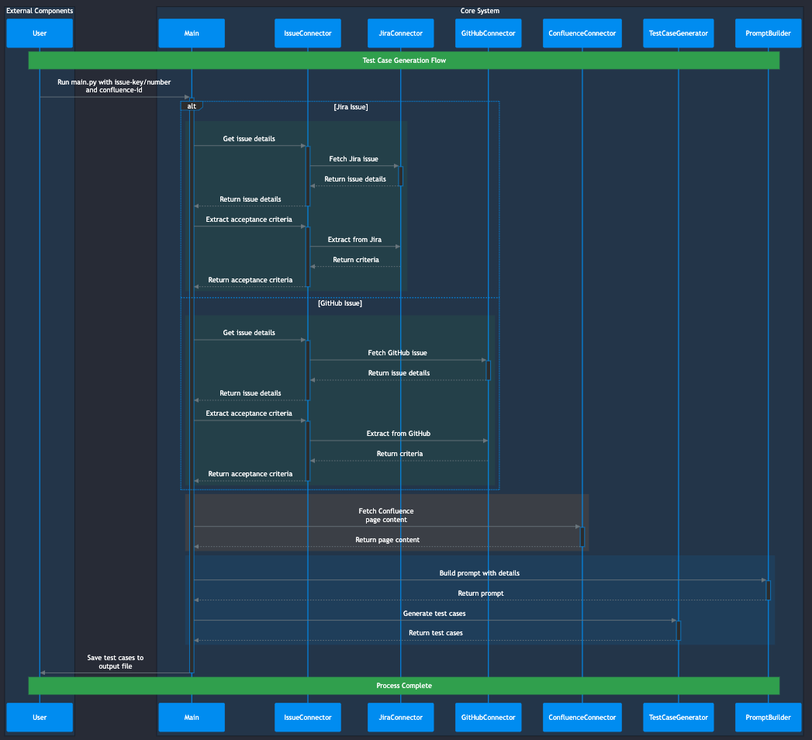

# FRIDAY - AI Test Case Generator

<p align="center">
  
</p>

An AI-powered test case generator that leverages Google Vertex AI and LangChain to automatically create test cases from Jira/GitHub issues and Confluence documentation.

## 🚀 Features

- Generate test cases using Google Vertex AI
- Extract requirements from Jira tickets or GitHub issues 
- Integrate context from Confluence pages
- Process data using LangChain's prompt engineering
- Store and search documents using ChromaDB vectorization
- Export test cases in JSON or Markdown format

## 📋 Prerequisites

- Python 3.12+
- Google Cloud Platform account with Vertex AI enabled or OpenAI
- Jira/GitHub and Confluence access credentials

## 🔄 Architecture



## ⚡️ Quick Start

1. Install via Homebrew:
```bash
brew tap dipjyotimetia/friday
brew install friday
```

2. Run setup:
```bash 
friday setup
```

3. Generate test cases:
```bash
# From Jira
friday generate --jira-key PROJ-123 --confluence-id 12345 -o test_cases.md

# From GitHub
friday generate --gh-issue 456 --gh-repo owner/repo --confluence-id 12345 -o test_cases.md
```

## 🛠 Manual Installation

1. Clone and setup:
```bash
git clone https://github.com/dipjyotimetia/friday.git
cd friday
chmod +x prerequisites.sh
./prerequisites.sh
```

2. Configure environment:
```bash
cp .env.example .env
# Add your credentials to .env
```

## 📖 Usage Options

### Web Crawler
```bash
# Crawl single domain
friday crawl https://example.com --provider vertex --persist-dir ./my_data/chroma --max-pages 5

# Crawl multiple domains
friday crawl https://example.com --provider vertex --persist-dir ./my_data/chroma --max-pages 10 --same-domain false
```

### Command Reference
```bash
friday --help          # Show all commands
friday version         # Display version
friday generate --help # Show generation options
```

### Parameters
- `--jira-key`: Jira issue key
- `--confluence-id`: Confluence page ID (optional)
- `--gh-issue`: GitHub issue number
- `--gh-repo`: GitHub repository (format: owner/repo)
- `--output`: Output file path (default: test_cases.json)

## 🔧 GitHub Action

```yaml
name: Friday Test Generator

on:
  pull_request:
    types: [opened, synchronize]
  workflow_dispatch:
    inputs:
      confluence_id:
        description: 'Confluence Page ID'
        required: true
      jira_id:
        description: 'Jira Issue ID'
        required: false

jobs:
  generate-tests:
    runs-on: ubuntu-latest
    steps:
      - uses: actions/checkout@v4
      
      - name: Generate Test Cases
        uses: dipjyotimetia/friday@main
        with:
          github_token: ${{ secrets.GITHUB_TOKEN }}
          confluence_url: ${{ secrets.CONFLUENCE_URL }}
          confluence_user: ${{ secrets.CONFLUENCE_USERNAME }}
          confluence_token: ${{ secrets.CONFLUENCE_API_TOKEN }}
          jira_url: ${{ secrets.JIRA_URL }}
          jira_user: ${{ secrets.JIRA_USERNAME }}
          jira_token: ${{ secrets.JIRA_API_TOKEN }}
          confluence_id: ${{ inputs.confluence_id || '12345' }}
          jira_id: ${{ inputs.jira_id || github.event.pull_request.number }}
          google_cloud_project: ${{ secrets.GOOGLE_CLOUD_PROJECT }}
          google_cloud_region: ${{ secrets.GOOGLE_CLOUD_REGION }}
          model_provider: 'vertex'
          persist_dir: './data/chroma'

      - name: Upload Test Cases
        uses: actions/upload-artifact@v4
        with:
          name: test-cases
          path: test_cases.md
```

## 💻 Development

```bash
# Run tests
poetry run pytest tests/ -v

# Format code
poetry run ruff format
```
